# PolygonPainter
A project done during Computer Graphics course at Warsaw University of Technology.
It is written in C# (Winforms).

A user may create polygons, set constraints on edges (such as a specific length, horizontal/vertical line).
Additionally, one may fill a previously created polygon providing an arbitral image. What is more, it is possible
to achieve a 3D filling effect if a user provides a normal vector map or/and a high map.

Moreover, there is a feature to compute the intersection of chosen polygons.

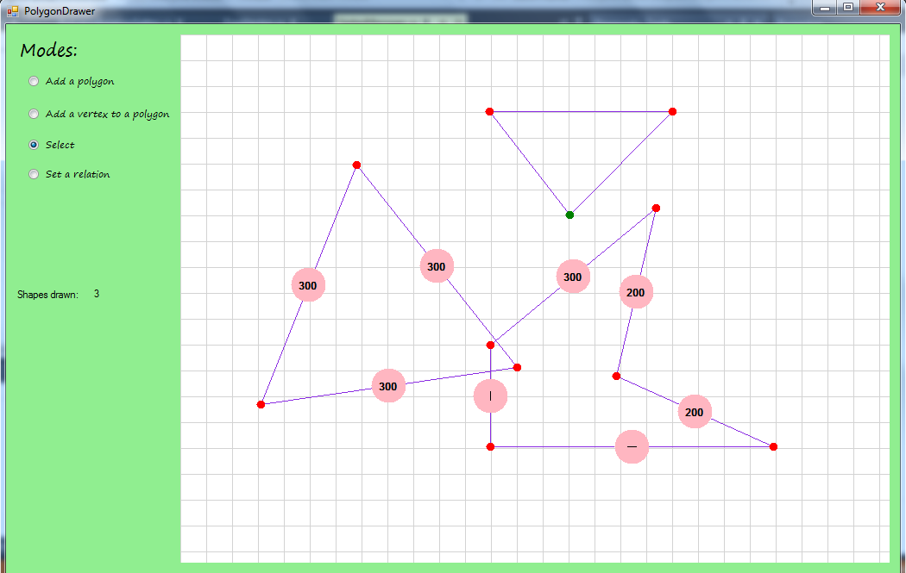
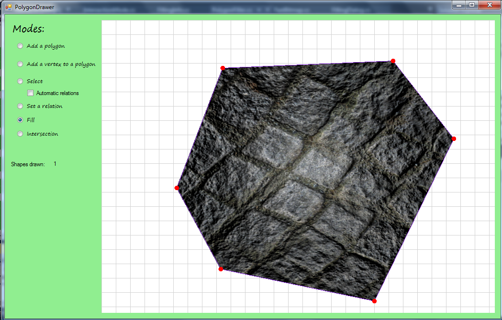
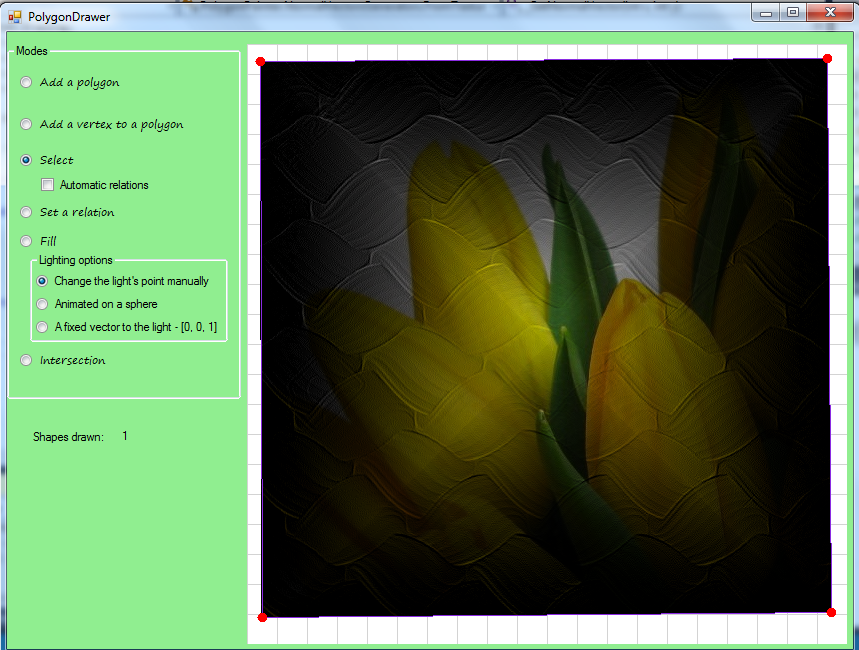
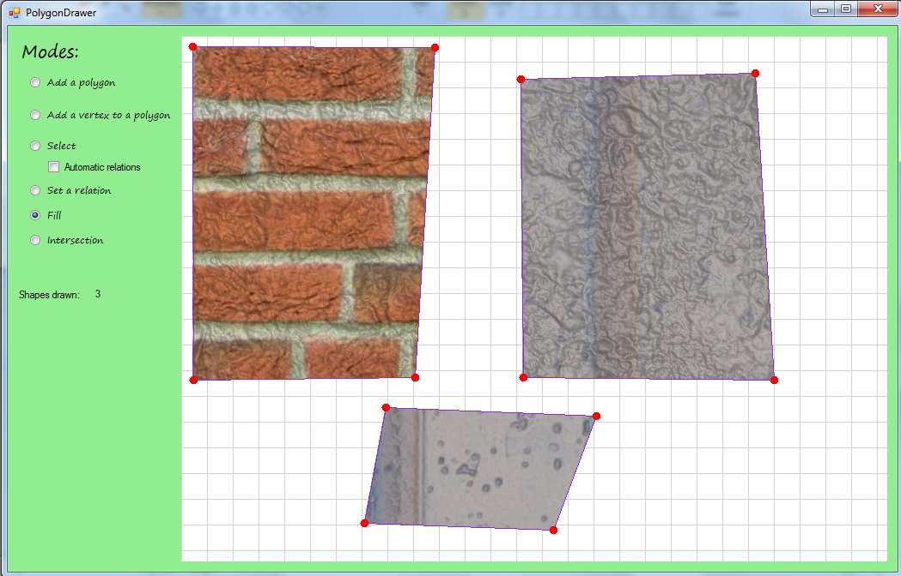
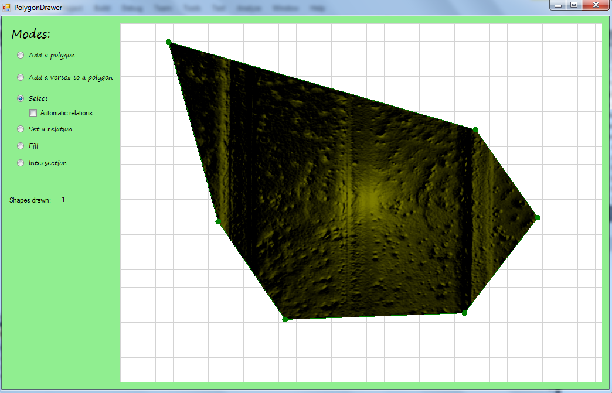
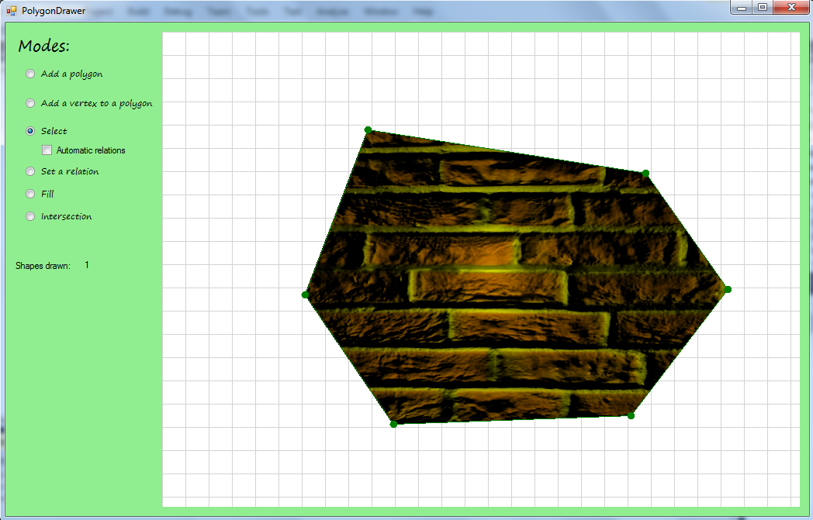
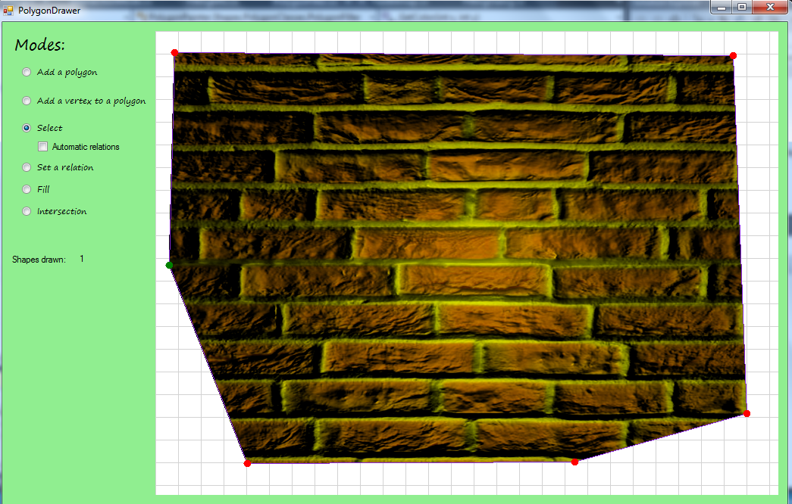
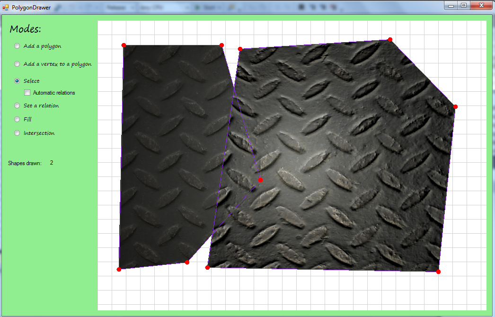
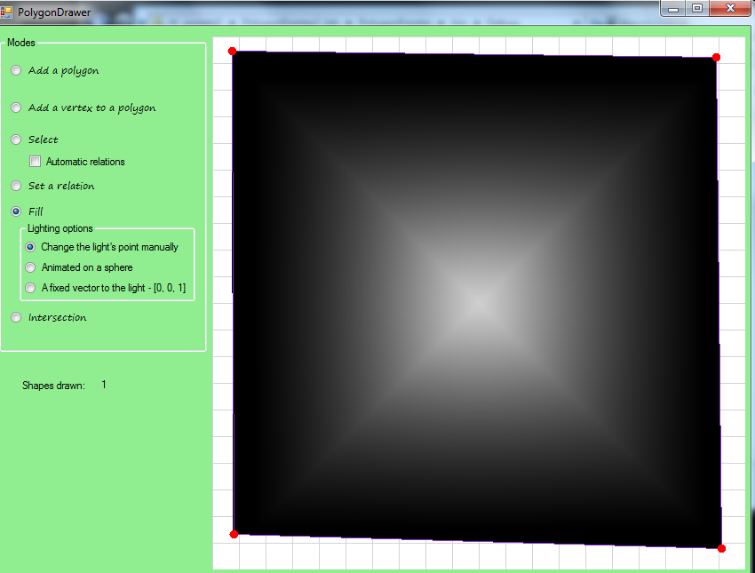
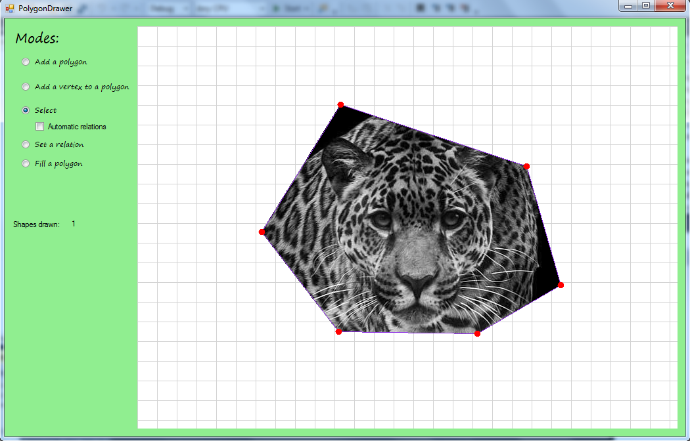
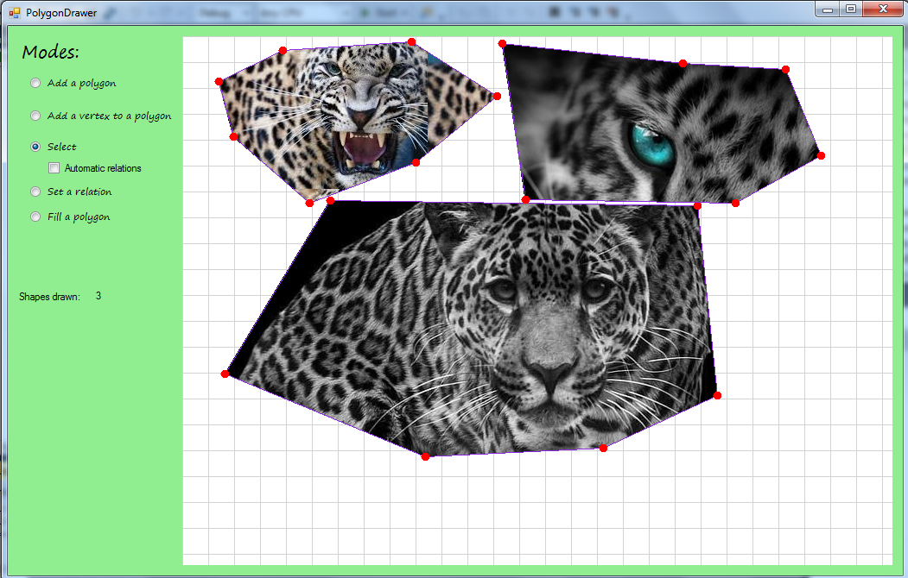
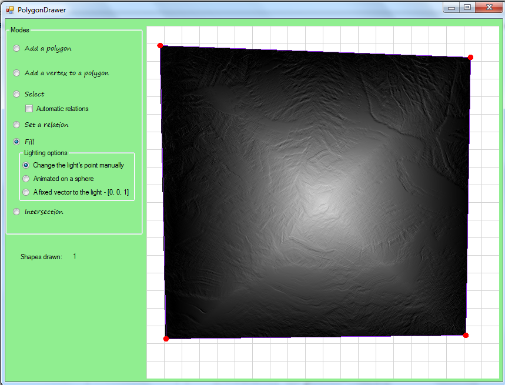
